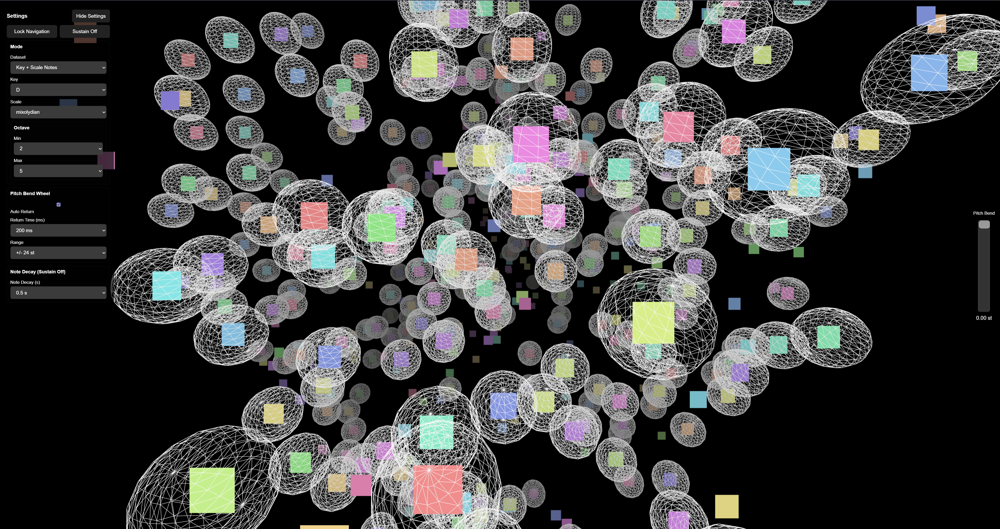

# music-browser

Interactive Three.js audio point cloud, refactored into a modular Vite project.

## Run locally

```bash
npm install
npm run dev
```

## Architecture

- `src/app/AppController.js`: app orchestration and lifecycle.
- `src/visualization/`: scene setup and point-cloud rendering.
- `src/interaction/`: hover/raycast interaction engine.
- `src/audio/`: audio contract and current tone implementation.
- `src/data/`: normalized point shape and point providers.
- `src/music/`: keys, scales, and frequency utilities.
- `src/ui/`: control panel for dataset/key/scale selection.

## Stress Testing



This image captures a stress test of the audio engine, activating as many simultaneous voices as possible.

## Point model contract

Visualization and interaction consume normalized points only:

```js
{
  id: "point-1",
  position: { x: 0, y: 0, z: 0 },
  color: "#ff00aa",
  sound: {
    type: "tone", // future: "sample" | "stream"
    frequency: 440
  },
  metadata: {}
}
```

## Data provider contract

Each provider implements:

```js
async getPoints(options) => Promise<NormalizedPoint[]>
```

Current providers:
- `RandomToneProvider`: random-note cloud (parity with original behavior).
- `KeyScaleToneProvider`: notes constrained to selected key and scale.

Future-ready placeholders:
- `UploadedAudioProvider`: map user-selected files to normalized points.
- `RemoteAudioProvider`: map remote URL/metadata records to normalized points.

## Audio engine contract

Audio playback is routed through:

```js
await audioEngine.init();
audioEngine.play(soundPayload);
audioEngine.stopCurrent();
```

Current implementation:
- `ToneAudioEngine` for synthesized tones.

To support decoded file playback or streaming later, add new audio engines that accept `sound.type === "sample"` or `"stream"` without changing visualization code.

## Available demo dataset modes

- `Random Notes`
- `Key + Scale Notes`

Available keys:
- `C`, `C#`, `D`, `D#`, `E`, `F`, `F#`, `G`, `G#`, `A`, `A#`, `B`

Available scales:
- `major`
- `naturalMinor`
- `harmonicMinor`
- `melodicMinor`
- `pentatonicMajor`
- `pentatonicMinor`
- `dorian`
- `mixolydian`
